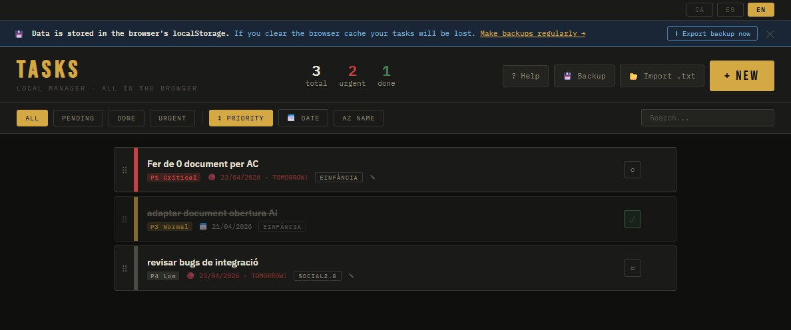
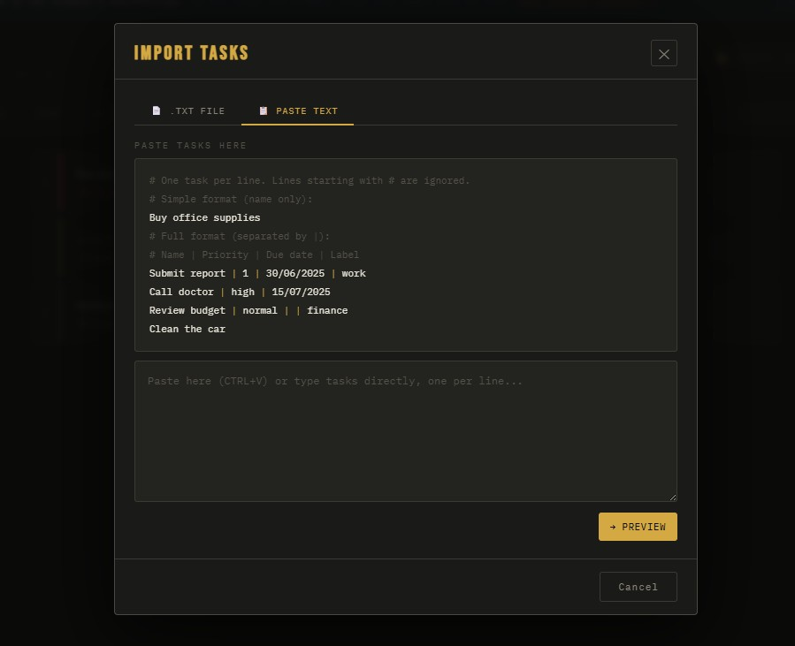

# Taskman Tool 📝

A minimalist, high-performance task management web application. Built with a sleek dark interface to help you focus on what matters most.

**Live Demo:** [https://taskmantool.vercel.app/](https://taskmantool.vercel.app/)

## 📸 Screenshots




## ✨ Key Features

*   **Task Management:** Quick entry, editing, and deletion of daily tasks.
*   **Smart Filtering:** Organize your view by priority, status (Pending/Done), or name.
*   **Local Persistence:** Data is stored directly in your browser's `localStorage` for privacy and instant access.
*   **Data Portability:** Export your task list to a `.txt` file for local backup.
*   **Responsive Dark UI:** Optimized for low-light environments and focused work.

## 🚀 Tech Stack

*   **Frontend:** HTML5, CSS3, JavaScript.
*   **Deployment:** Vercel.
*   **Storage:** Browser LocalStorage API.

## 🛠️ Getting Started

To run this project locally:

1. **Clone the repository:**
   ```bash
   git clone https://github.com
   ```
2. **Navigate to the directory:**
   ```bash
   cd taskman-tool
   ```
3. **Launch:**
   Simply open `index.html` in your favorite browser or use a live server extension.

## 🔒 Privacy & Security

This app operates entirely on the client side.
*   **No Backend:** Your data never leaves your device.
*   **Persistence:** Tasks remain saved even after refreshing the page.
*   **Warning:** Clearing your browser cache/storage will delete your tasks. Use the **Export** feature to keep a backup.

## 📄 License

This project is licensed under the MIT License.

# Tasques App 📝

Una aplicació web minimalista i eficient per a la gestió de tasques personals, dissenyada amb una interfície fosca i focus en la productivitat.

## ✨ Característiques

*   **Gestió de Tasques:** Crea, edita i elimina tasques fàcilment.
*   **Priorització:** Sistema visual per identificar tasques urgents, fetes o pendents.
*   **Estat Local:** Les dades s'emmagatzemen al `localStorage` del navegador per a privadesa i rapidesa.
*   **Filtres Avançats:** Cerca i filtra per prioritat, estat o nom.
*   **Exportació:** Opció per exportar les teves tasques en format `.txt`.
*   **Interfície Adaptativa:** Disseny modern amb mode fosc (Dark Mode).

## 🚀 Tecnologies Utilitzades

*   Frontend: HTML5, CSS3, JavaScript.
*   Framework/Llibreria: [Insereix aquí React/Vue/Next.js si s'escau].
*   Desplegament: Vercel.

## 🛠️ Instal·lació i Ús

Si vols executar aquest projecte localment:

1. Clona el repositori:
   ```bash
   git clone https://github.com
   ```
2. Entra al directori:
   ```bash
   cd tasques-app
   ```
3. Obre el fitxer `index.html` al teu navegador o executa:
   ```bash
   npm install && npm start
   ```

## 🔒 Seguretat i Privadesa

L'aplicació utilitza el **LocalStorage** del navegador. Això vol dir que:
*   Les dades no s'envien a cap servidor extern.
*   Si esborres les dades del navegador, les tasques es perdran.
*   Es recomana fer còpies de seguretat periòdiques amb la funció d'exportació.

## 📄 Llicència

Aquest projecte està sota la llicència MIT.
