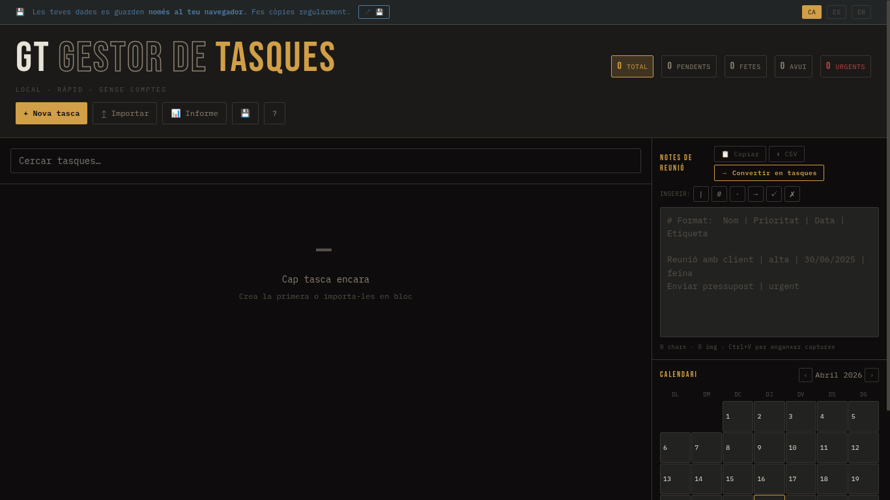
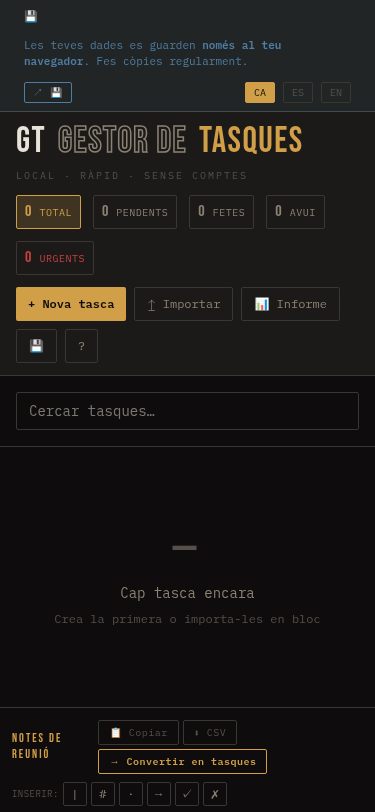

# GT · Gestor de Tasques

> **Brutalist task manager · 100 % local · zero accounts · zero servers.**

Tot s'emmagatzema al `localStorage` del teu navegador. Cap petició, cap *tracker*, cap *backend*. Funciona també sense connexió.



---

## ✨ Què fa

| Bloc | Detall |
|------|--------|
| 🗒️ **Tasques** | Prioritat 1–5, data, estat, etiquetes múltiples, descripció rica amb captures intercalades (`Ctrl+V`). |
| 🔁 **Recurrència** | Diària, setmanal (multi-dia), quinzenal, mensual amb *clamp* a final de mes. Final per ocurrències o data. |
| 📓 **Notes de reunió** | Editor ric (text + captures inline) + conversió directa a tasques (`Nom \| Prioritat \| Data \| Etiqueta`). |
| 📅 **Calendari** | Vista mensual + filtre per dia. |
| 🏷️ **Etiquetes** | Color determinista, gestió i filtre. |
| 📊 **Informe** | Mensual amb *friendly copy* + export CSV (UTF-8 BOM). |
| 📥 **Importació en bloc** | Text amb `\|` o CSV. |
| 🔗 **Enllaços** | Panell lateral. |
| 💾 **Còpia de seguretat** | Export / import JSON. |
| 🌐 **i18n** | Català · Castellà · Anglès. |

### 📱 Mòbil

- Layout responsive: el panell lateral col·lapsa sota la llista.
- **Llisca cap a l'esquerra** sobre una tasca per eliminar-la (confirmació).
- Header compacte, *touch targets* grans.



---

## 🚀 Posada en marxa local

```bash
npm install      # o bun install / pnpm install
npm run dev
```

Obre <http://localhost:5173>.

## ☁️ Desplegament a Vercel

Aquest paquet **ja està preparat per Vercel** (Vite SPA + `vercel.json` amb *rewrites* per al routing client-side).

1. Puja el codi a GitHub.
2. A Vercel: *New Project* → importa el repo.
3. Framework preset: **Vite** (autodetectat).
4. *Build command*: `npm run build` · *Output directory*: `dist`.
5. Deploy.

No cal cap variable d'entorn. No cal cap base de dades.

---

## ⌨️ Dreceres

| Tecla | Acció |
|-------|-------|
| `Ctrl+V` | Enganxa text **o captura** dins l'editor ric |
| `Ctrl+Enter` | Guarda tasca |
| `Esc` | Tanca modal |

---

## 🧱 Arquitectura

```
src/
├── lib/gt/
│   ├── types.ts        # Tipus de domini
│   ├── i18n.ts         # Diccionaris ca/es/en
│   ├── utils.ts        # Helpers (date, tags, parser, CSV)
│   ├── recurrence.ts   # Motor de recurrència + tests
│   └── store.ts        # Hooks de localStorage
├── components/gt/
│   ├── TaskList.tsx · TaskRow.tsx (swipe-to-delete)
│   ├── TaskModal.tsx · NotesPanel.tsx · CalendarPanel.tsx
│   ├── LinksPanel.tsx · TagLegend.tsx
│   ├── ReportModal.tsx · ImportModal.tsx · BackupModal.tsx · HelpModal.tsx
│   ├── RichNotes.tsx · Modal.tsx · Toast.tsx · buttons.tsx
└── pages/Home.tsx      # Composició principal
```

## 🐛 Bugs corregits respecte al HTML monolític original

1. `endDate` no era inclusiva → ara sí.
2. `parseISO` interpretava ISO com a UTC i desplaçava el dia → ara local.
3. Setmanal amb dies buits queia silenciosament → fallback a la setmana base.
4. Quinzenal incorrecte → corregit (avanç de 14 dies + dies marcats).
5. Mensual no clampava a final de mes (31 gen → 3 mar) → ara `min(day, lastDay)`.
6. Bucles sense límit dur → `MAX_OCCURRENCES = 366`.
7. Editar una tasca de sèrie no recuperava la config → ara s'infereix dels germans.
8. Notes/captures: galeria al final → ara intercalades **dins** el text.

## 🧪 Proves de regressió (9/9 ✓)

Cobrim: daily · weekly multi-dies · biweekly · mensual amb *clamp* 31→28/29 · fi de data inclusiva · dies buits · disabled · `count=0` · fi abans del base.

---

## 📄 Llicència

MIT · feliç de fer-lo servir, *forkar*-lo i adaptar-lo.
